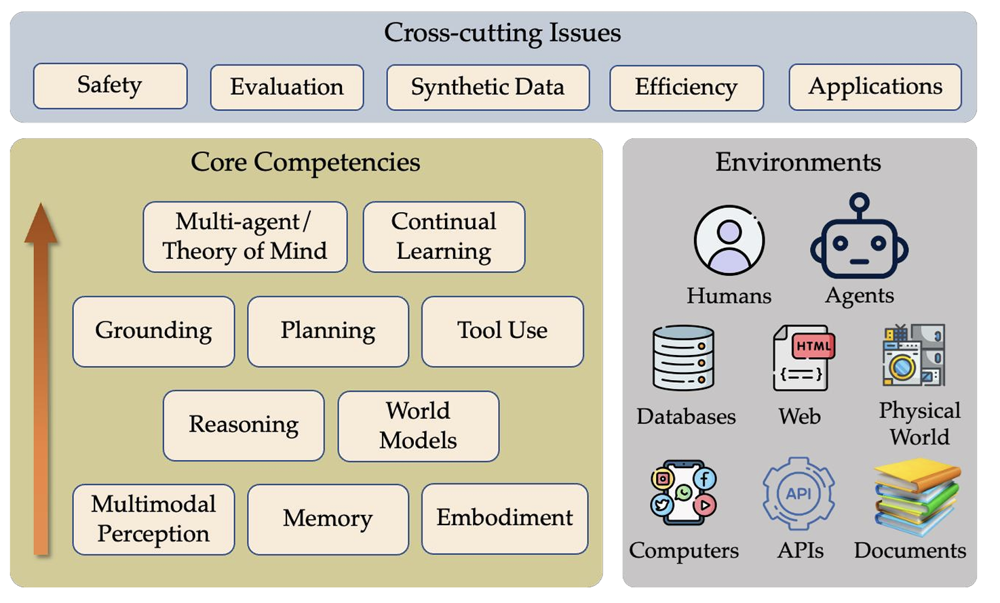

# Agents
## Relevant agent workshops and talks
- ICLR Workshop on LLM Agents
-    

## A Conceptual Framework

## 文章
1. AI Agent（智能体）技术白皮书（Google，2024）
   - 中文：https://arthurchiao.art/blog/ai-agent-white-paper-zh/
   - 英文：https://github.com/MIG217/Agents/blob/main/Whitepaper/Newwhitepaper_Agents2.pdf
2. Building effective agents (Anthropic, 2024)
   - 中文：https://arthurchiao.art/blog/build-effective-ai-agent-zh/
   - 英文：https://www.anthropic.com/research/building-effective-agents
   - 文章中给的一些例子：https://github.com/anthropics/anthropic-cookbook/tree/main/patterns/agents
3. Harnessing the Power of LLMs in Practice: A Survey on ChatGPT and Beyond(Amazon, 2023)
   - summary: 大语言模型（LLMs）实用指南, 主要关注下游 NLP 任务中如何使用 LLM
   - paper: https://arxiv.org/abs/2304.13712
   - github: https://github.com/Mooler0410/LLMsPracticalGuide

## Blog
1. Jason Brownlee创建，侧重机器学习、深度学习和DS；Python； https://machinelearningmastery.com/
2. Julia Silge创建，侧重R语言和tidyverse；https://juliasilge.com/
3. Rob J. Hyndman 维护，侧重时间序列；https://robjhyndman.com/hyndsight/
4. `caret` R 包的官方文档；https://topepo.github.io/caret/
5. Richard S. Sutton：http://incompleteideas.net/
6. Shunyu Yao，CoALA和ReAct的论文 也很值得看 https://ysymyth.github.io/
7. https://lilianweng.github.io/

## Datasets
1. GitHub 资源合集，收集了各类 公开可用的数据集；https://github.com/smuthubabu/awesome-public-datasets
2. AWS提供的开放数据存储平台; https://registry.opendata.aws/
3. 全球开放数据门户的集合: https://dataportals.org/search
4. 欧洲各国和地区发布的开放数据集: https://opendatamonitor.eu/frontend/web/index.php?r=datacatalogue%2Flist&page=1&per-page=10

## Agent平台
1. Dify: https://cloud.dify.ai/apps
2. AutoGen 更适合multi-agent
3. Langchain 
4. IBM watsonx.ai https://www.ibm.com/products/watsonx-ai/ai-agent-development
5. FastGPT https://cloud.tryfastgpt.ai/app/list
6. coze 

## Mooc
1. UC Berkeley CS294/194-196 Large Language Model Agents： [CS294/194-196 Large Language Model Agents](https://rdi.berkeley.edu/llm-agents/f24)
2. UC Berkeley CS294/194-280 Advanced Large Language Model Agents: https://rdi.berkeley.edu/adv-llm-agents/sp25
3. DeepLearning.AI Multi AI Agent Systems with crewAI: https://learn.deeplearning.ai/courses/multi-ai-agent-systems-with-crewai

## Prompt Engineering 
1. [OpenAI Cookbook](https://github.com/openai/openai-cookbook)有许多关于如何有效利用 LLM 的深入示例。
2. [提示词工程指南](https://github.com/dair-ai/Prompt-Engineering-Guide)库包含有关prompt工程的相当全面的教育材料集合。
